# 🤖 VICTOR: Premium AI Tactical Assistant

VICTOR is a state-of-the-art, voice-enabled, vision-capable AI tactical assistant designed to automate system, browser, and OS-level operations through natural language. Utilizing high-performance Large Language Models (LLMs) and Vision Language Models (VLMs) via key-rotated API endpoints, VICTOR provides seamless automation, web search, real-time research synthesis, and high-fidelity text-to-speech feedback.

---

## 📐 Architecture Overview

VICTOR operates as a FastAPI backend communicating with a sleek, glassmorphic front-end dashboard using Server-Sent Events (SSE). The system coordinates multiple specialized service components via a central Cognitive Router.

```mermaid
graph TD
    A["User Input (Speech / Text / File Upload)"] --> B["FastAPI Backend (app/main.py)"]
    B --> C["Cognitive Router & Planner (app/services/brain_service.py)"]
    C --> D{"Intent Classifier"}
    
    D -->|"chat"| E["Chat Stream (app/services/ai_service.py)"]
    D -->|"research"| F["Dual-Distillation Search (app/services/realtime_service.py)"]
    D -->|"vision"| G["VLM Analyzer + Biometric Face ID (app/services/vision_service.py)"]
    D -->|"task"| H["Windows/Browser Automation (app/services/task_executor.py)"]
    
    E --> I["edge-tts Stream Output"]
    F --> J["Formatted Sidebar Report + Citation Links"]
    G --> I
    H --> K["PyAutoGUI / Playwright Browser / Windows OS Actions"]
    
    L["Proactive Loop (app/services/proactive_service.py)"] -->|"/chat/victor/proactive"| B
    M["Local Memory (database/memory/memory.json)"] <--> B
```



---

## 🌟 Key Features

### 🧠 1. Cognitive Router & Execution Planner
* **Intent Classification**: Evaluates user queries and routes them to four primary pipelines: `chat`, `research`, `vision`, or `task`.
* **Plan Decomposition**: Intelligently splits multi-task instructions (e.g., *"Open notepad, set volume to 50%, and check the weather in Berlin"*) into sequential execution lists.
* **Compound Action Splitting**: Automatically splits combined commands (e.g., *"open notepad and type hello world"*) into separate launcher and keystroke actions.
* **Memory Memorization**: Dynamically records user preferences, titles, names, and customized details into a local database (e.g., *"remember that my favorite color is crimson"*).
* **Multi-Session Context Stitching**: Scans all active and historical chat session files (ordered by modification time) to assemble a rolling history of the last 10 interactions for unified contextual awareness.
* **Token Pruning & Context Compression**: Automatically slices conversational history and file uploads via utility functions to prevent API token/request limit overflows.

### 🖥️ 2. OS & Window Control
* **Volume & Brightness**: Seamlessly increases, decreases, mutes/unmutes, or sets system volume and brightness to exact percentages.
* **Window Management**: Minimizes, maximizes, toggles full screen, shows desktop, closes windows or specific applications, and cycles active programs.
* **Window Grid Layout Snapping**: Automatically snaps active application windows to the left or right halves of the screen.
* **Smart System Launchers**: Normalizes and opens over 20 preconfigured applications (Chrome, Brave, VS Code, Telegram, WhatsApp, Spotify, Settings, etc.) using system executables, protocol URIs, or PyAutoGUI keystroke fallbacks.
* **Power Utilities**: Handles system lock, screen display sleep, system reboot, and system shutdown commands.
* **Wi-Fi & Theme Toggles**: Toggles Wi-Fi adapters and switches between Windows Light and Dark system themes.
* **Keystroke & Clipboard Simulation**: Translates requests for basic editing tasks (Select All, Copy, Cut, Paste, Undo, Redo, Save, Enter, Escape) into simulated key events.
* **Coordinate Mouse Interactions**: Allows precision mouse automation (single-click, right-click, double-click, move, drag) targeted at specific X and Y screen coordinates.

### 📂 3. Desktop Management
* **Desktop Organizing**: Automatically categorizes files on the Windows Desktop into designated folders (`Images`, `Documents`, `Videos`, `Music`, `Archives`, `Code`, `Executables`, `Others`) based on file extension while preserving `.lnk` and `.url` shortcuts.
* **Desktop Cleaning**: Safely archives clutter by moving non-link desktop files into a dated archive directory (`Desktop Archive YYYY-MM-DD`).
* **Desktop Stats & Listing**: Inspects and lists all files/folders on the desktop and computes the total disk space occupied.
* **Wallpaper Engine**: Updates the Windows desktop background using a local path or a web image URL (with automatic conversion of `.webp`/`.png` to `.bmp` via PIL).

### ⏰ 4. Native OS Scheduler & Reminders
* **Native Task Scheduling**: Schedules one-time events or custom alerts using the native Windows Task Scheduler (`schtasks`) from natural language queries (e.g., *"remind me to call John in 15 minutes"*).
* **System Notification Alerts**: Triggers a system beep audio cue (`winsound`) and a native Windows message alert box (`MessageBoxW`) when scheduled tasks are fired.

### 🌐 5. Web Browser & Media Automation
* **Direct Navigation**: Opens custom websites, handles domain aliases, and performs web actions.
* **Tab & Navigation Controls**: Controls tabs (new tab, close tab, next tab, previous tab), page history (back/forward), refresh, zoom controls, and page scrolling.
* **Fuzzy Playwright Browser Automation**: Uses Playwright to execute advanced, persistent browser interactions (switching browser targets, listing active sessions, searching with engines, and performing fuzzy element clicking and typing).
* **YouTube Playback Automation**: Resolves direct URLs or searches and plays YouTube content directly, bypassing standard search results.

### 🔍 6. Real-Time Web Research & Data Verification
* **Web Search**: Integrates DuckDuckGo as the primary search engine for fast, reliable search query execution, with the Tavily API acting as a robust fallback.
* **Dual-Distillation Search Synthesis**: Performs a single LLM request to generate a concise or conversational response (adapted based on query complexity for Text-To-Speech) and a detailed 250-word markdown sidebar breakdown with comparative tables and citation links.
* **Data & Currency Accuracy Engine**: Cross-references query results to reject outdated estimates (e.g., stale currency exchange rates) in favor of authoritative live values. Provides typical price ranges when sources show varying prices, ensuring strict data consistency without hallucination.

### 👁️ 7. Computer Vision & Face Identification
* **Image Analysis**: Uses Groq-powered Vision Language Models to analyze uploaded images or webcam snapshots.
* **Prompt Interaction**: Ask questions directly about the image (e.g. *"What do you see?"*, *"What color is this?"*).
* **Face Recognition & Biometric Enrolment**: Integrates the `face_recognition` package to identify known faces and their relationships to you (e.g., greeting them by name), or prompting to save unidentified individuals.

### 🎙️ 8. High-Fidelity Voice Output (TTS)
* **Scrubbing Engine**: Cleans LLM outputs of thinking blocks (`<think>...</think>`), tables, markdown symbols, and emojis before synthesis.
* **Real-Time Streaming**: Uses `edge-tts` to stream audio bytes directly to the frontend.

### 📁 9. File Understanding & Reading Engine
* **Text & Code Files**: Parses plain text, Python, JavaScript, HTML, CSS, JSON, etc.
* **Office & Document Formats**: Extracts text from Word documents (`.docx`), Excel spreadsheets (`.xlsx`/`.xls`), and PDF documents (`.pdf`) using pre-installed document parsers (supporting fallbacks like `fitz`/`pypdf`).
* **Context Injection**: Intelligently appends extracted file contents (up to a 100k character limit to prevent token overflow) to the user prompt context, enabling the Cognitive Router and AI completion streams to seamlessly explain, summarize, or analyze files.
* **Auto-Chat Routing**: Detects file uploads and routes them directly to chat mode instead of misclassifying them as research queries.
* **Dynamic Learning Domain Reader**: Automatically loads and binds any `.txt` files located in the `database/learning_data/` directory to feed specialized facts directly to the memory context.

### 🖥️ 10. Interactive Task Viewer & Editor
* **Task Result Inspection**: A dedicated `/frontend/viewer.html` interface polls for background task completion.
* **Image Previewer**: Renders generated images inside a responsive viewer frame with download and copy capabilities.
* **Markdown Text Editor**: Displays generated text outputs inside a full-screen, editable textarea, tracking word count and allowing downloads in `.txt` or `.md` formats.

### 🚨 11. Proactive Telemetry & Status Engine
* **Resource Monitoring**: Tracks CPU (warns if $\ge 80\%$), RAM (warns if $\ge 85\%$), and C Drive Space (warns if $<15$ GB free) and recommends solutions (e.g. cache cleanup).
* **Git Status Telemetry**: Identifies uncommitted modifications in the codebase and offers review/commit workflows. Strains duplicate warnings: if the set of modified files remains the same, it only repeats alerts after a 4-hour cooldown.
* **Late Night Rest Reminders**: Monitors time and triggers gentle rest notifications between 11 PM and 3 AM.
* **Persistent Cooldowns**: Enforces strict, server-restart-proof cooldown periods (e.g., 30 minutes to 4 hours) via the persistent `memory.json` store to avoid Groq rate limit exhaustion.
* **Anti-Repetitive Chat Context**: Passes the last 3 conversational turns to the system prompt of proactive generators, enforcing the LLM to vary its greetings, suggestions, and check-in questions dynamically.

---

## 📁 Project Structure

```
VICTOR/
├── run.py                 # Core startup script with validation checks
├── config.py              # Central configuration loader and folder setup
├── requirements.txt       # Project python dependencies
├── .env                   # API keys and system environment variables
├── test.py                # Additional test script for TTS streaming
├── app/
│   ├── main.py            # FastAPI main router, stream and upload endpoints
│   ├── models.py          # Pydantic data schemas
│   ├── services/
│   │   ├── ai_service.py        # LLM streaming & structured responses
│   │   ├── brain_service.py     # Cognitive routing & intent classification
│   │   ├── realtime_service.py  # Web search integration (DuckDuckGo/Tavily)
│   │   ├── memory_service.py    # Session logs and persistent database
│   │   ├── vision_service.py    # VLM image analyzer
│   │   ├── face_service.py      # Face recognition and biometric tracking
│   │   ├── proactive_service.py # System diagnostics & check-in notifications
│   │   └── task_executor.py     # Windows & browser automation execution engine
│   └── utils/
│       ├── file_pruning.py      # Token pruning and context limit truncation
│       ├── key_rotation.py      # API key rotating logic
│       ├── retry.py             # Error-handling & retry wrappers
│       └── time_info.py         # Timestamp helpers
├── database/              # Stores local persistent data
│   ├── chats_data/        # Stores session-specific conversation JSON files
│   ├── learning_data/     # Stores domain-specific raw text context documents
│   └── memory/            # Stores memory.json preferences database
├── frontend/              # Sleek dark-mode dashboard files
│   ├── index.html         # Main dashboard layout structure
│   ├── style.css          # Premium glassmorphic styling sheet
│   ├── orb.js             # Canvas/WebGL glowing animated AI orb
│   ├── script.js          # Core frontend event handling and SSE client
│   └── viewer.html        # Interactive task output viewer and editor
└── workspace/             # Directory for storing temporary files or uploads
    ├── uploads/           # Holds files, snapshots, and uploaded assets
    │   └── faces/         # Holds facial recognition images and profiles
    └── temp/              # Stores temporary execution data
```

---

## 📂 File & Directory Responsibilities

### 🗝️ Root Directory
* **`run.py`**: The main system launcher. Validates the environment variables, imports configuration settings (which auto-creates directories), starts the FastAPI server using `uvicorn`, and automatically boots Google Chrome to show the dashboard.
* **`config.py`**: Resolves directories, ensures required folders exist, and loads configurations (API keys, models, TTS voices, and owner info) from `.env`.
* **`requirements.txt`**: Lists all mandatory and optional Python libraries.
* **`.env`**: Contains sensitive environment variables, API key rotation keys, active model parameters, and persona setups.
* **`test.py`**: A diagnostic testing script designed to verify if the text-to-speech engine streams audio correctly.

### ⚙️ App Source & Services (`app/`)
* **`app/main.py`**: The server coordinator. Controls API routes, server-sent event (SSE) streaming (`/api/stream`), real-time speech synthesis hooks, file uploads, and background task maps.
* **`app/models.py`**: Contains Pydantic models: `ExecutionPlan` and `TTSRequest`.
* **`app/services/ai_service.py`**: Interacts with the Groq client. Buffers and streams model tokens while dynamically scrubbing `<think>` tokens on the fly. Utilizes rotation and retry decorators.
* **`app/services/brain_service.py`**: Cognitive Router. Analyzes inputs, handles token context pruning, decides the pipeline (chat, research, vision, task), splits compound actions, normalizes names, and formats plans.
* **`app/services/realtime_service.py`**: Executes search queries. Attempts DuckDuckGo search first, falling back to Tavily search if DuckDuckGo fails.
* **`app/services/memory_service.py`**: Integrates persistent memory context. Loads `memory.json`, extracts domain documents from `database/learning_data/`, reads previous session logs (up to 10 entries sorted by modification time), and handles updates/deletions.
* **`app/services/vision_service.py`**: Integrates webcam or uploaded image processing. Directs image analysis prompts to Groq VLM while invoking facial recognition checks first to inject biometric identity context.
* **`app/services/face_service.py`**: Coordinates face comparison and saving. Loads numpy encoding arrays from `known_faces.json` and compares them against faces found in webcam snapshots.
* **`app/services/proactive_service.py`**: Houses the system diagnostic loop. Tracks hardware statistics, git statuses, and nighttime hour checks to generate proactive suggestions, utilizing persistent memory cooldowns to prevent API key spam.
* **`app/services/task_executor.py`**: Windows and browser automation engine. Translates execution plans into primitive actions, executes system applications, controls audio/display settings, snaps windows, sets wallpaper, schedules task alerts, handles precise mouse click/drag coordinates, and operates Playwright browser drivers.

### 🛠️ App Utilities (`app/utils/`)
* **`app/utils/file_pruning.py`**: Truncates over-long file blocks or context string histories to fit within API context size boundaries.
* **`app/utils/key_rotation.py`**: Manages rotating sets of API keys (Groq, Tavily, VLM) to distribute usage and handle rate limits.
* **`app/utils/retry.py`**: Implements decorator logic that intercepts rate limits or timeouts, triggering key rotations and exponential backoff.
* **`app/utils/time_info.py`**: Produces formatted string contexts showing real-world local dates, times, and timezones.

---

## 🚀 Setup & Installation

### 1. Prerequisites
- **OS**: Windows 10/11
- **Python**: version 3.10 or 3.11 (Python 3.11 recommended)
- **Required System Tools**: Google Chrome (for automated launching)

### 2. Dependency Installation
Install required packages via pip:
```bash
pip install -r requirements.txt
```

> [!NOTE]
> The `face_recognition` library requires Visual Studio C++ build tools and CMake to build the dlib dependency on Windows. Ensure they are installed if CMake errors occur.

Install Playwright drivers for browser automation:
```bash
playwright install
```

### 3. Configure Environment Variables
Create a `.env` file in the root directory:
```env
PORT=8000
HOST=127.0.0.1

# Key Rotation Arrays (Up to 3 keys supported)
GROQ_API_KEY1=your-groq-key-1
GROQ_API_KEY2=your-groq-key-2
GROQ_API_KEY3=your-groq-key-3

TAVILY_API_KEY=your-tavily-key-1
TAVILY_API_KEY_2=your-tavily-key-2
TAVILY_API_KEY_3=your-tavily-key-3

GROQ_VLM_API_KEY_1=your-vlm-key-1
GROQ_VLM_API_KEY_2=your-vlm-key-2
GROQ_VLM_API_KEY_3=your-vlm-key-3

# Models
GROQ_MODEL=llama-3.3-70b-versatile
GROQ_VLM_MODEL=meta-llama/llama-4-scout-17b-16e-instruct

# TTS voice (e.g. en-GB-RyanNeural, en-US-ChristopherNeural)
TTS_VOICE=en-GB-RyanNeural
TTS_RATE=+22%

# Assistant Details
ASSISTANT_NAME=VICTOR
VICTOR_USER_TITLE=Sir
VICTOR_OWNER_NAME=Shashank
```

### 4. Launching VICTOR
Run the core startup script:
```bash
python run.py
```
This runs the initial system checks. If all variables are set, the FastAPI server will boot up and the premium dashboard will be hosted at `http://127.0.0.1:8000`.

---

## 🧪 Verified Feature Tests

VICTOR features have been thoroughly verified with a local programmatic test suite testing each service component end-to-end. Here are the results:

| Feature Category | User Input Example | Resolved Intent / Action | Expected Result |
| :--- | :--- | :--- | :--- |
| **Cognitive Routing** | `"increase volume to 80%"` | `task` | Executed Windows volume adjustment |
| **Cognitive Routing** | `"what's the weather in Paris?"` | `research` | Triggers DDG/Tavily weather scraping |
| **Cognitive Routing** | `"remind me to call John at 14:30"` | `task` | Schedules alert box via `schtasks` |
| **System Launcher** | `"open chrome"` | `open_app` | Launches Chrome browser process |
| **Browser Action** | `"go to github.com"` | `open_url` | Directs active window / tab to URL |
| **Voice Output** | *Any text output* | `TTS Synthesis` | Streams edge-tts audio bytes |
| **VLM Vision** | *Upload solid red image* | `VLM Response` | Returns *"The image is red."* |
| **Face Recognition**| *Webcam feed snapshot* | `Biometrics` | Greets recognized face by name |
| **File Parser** | *Upload `.pdf`, `.docx`, or `.xlsx`* | `File Extraction` | Appends file content to context |

---

## ⚙️ Under The Hood Mechanics

### 🗝️ API Key Rotation & Resiliency
VICTOR leverages a custom utility `app/utils/key_rotation.py` to manage multi-key rotation arrays. When an API request hits a rate limit (HTTP 429) or a timeout, a retry decorator (`app/utils/retry.py`) catches the exception, shifts the active API index to the next key in the pool, and attempts the operation again with exponential backoff.

### 📚 Dual-Distillation Synthesis
When executing queries categorized as `research`, VICTOR performs a dual-distillation process:
1. It queries DuckDuckGo or Tavily for live snippets.
2. It makes a single LLM request instructing the model to generate a clean, unformatted text block for immediate text-to-speech reading.
3. Concurrently, it formats a detailed, markdown-rich sidebar containing comparative data tables, structured bullet points, and source citations.

### 💾 Smart Memory & Dynamic Learning
VICTOR maintains local persistence:
- **`memory.json`**: Houses static facts like the user's name or preferred music commands.
- **`learning_data/`**: Allows you to drop plain text `.txt` files containing custom documentation or facts. VICTOR automatically reads all documents inside this folder and appends them to the system prompt context.

### 🚪 Automated Startup Control
To prevent Groq API rate limit exhaustion, the startup sequence registers the timestamp of its first run in `memory.json`. Any subsequent page reloads or client connections on the same day skip the full telemetry check and web scraping steps, returning a premium welcome greeting immediately.

---

## 🛡️ License
Designed for personal use and automation assistance. All rights reserved to developer team.
